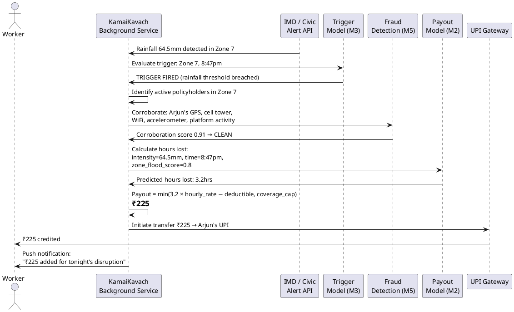

# KamaiKavach — AI-Powered Parametric Income Insurance for Food Delivery Partners

> **Guidewire DEVTrails 2026 | Phase 1 Submission**
> Persona: Food Delivery (Zomato / Swiggy) · Platform: Mobile-First Native App · Pricing: Weekly

---

## Table of Contents

1. [Problem Statement](#1-problem-statement)
2. [Our Solution](#2-our-solution)
3. [Why Mobile-First](#3-why-mobile-first)
4. [Persona & Use Case Scenarios](#4-persona--use-case-scenarios)
5. [Application Workflow](#5-application-workflow)
6. [Onboarding Design](#6-onboarding-design)
7. [Model 1 — Weekly Premium Calculation](#7-model-1--weekly-premium-calculation)
8. [Model 2 — Payout Calculation](#8-model-2--payout-calculation)
9. [Model 3 — Parametric Trigger Detection](#9-model-3--parametric-trigger-detection)
10. [Model 4 — Individual Risk Scoring (Underwriting)](#10-model-4--individual-risk-scoring-underwriting)
11. [Model 5 — Fraud Detection & GPS Spoofing Defence](#11-model-5--fraud-detection--gps-spoofing-defence)
12. [GPS Spoofing: The Coordinated Fraud Threat](#12-gps-spoofing-the-coordinated-fraud-threat)
13. [Tech Stack](#13-tech-stack)
14. [Development Plan](#14-development-plan)
15. [Future Developments](#15-future-developments)

---

## 1. Problem Statement

India's food delivery workforce — over 5 million partners on Zomato and Swiggy — earns ₹500–₹1,200 per day with no income safety net. External disruptions outside their control cause them to lose 20–30% of monthly earnings with zero recourse.

These disruptions are **not accidents or health emergencies**. They are environmental and social events — monsoon rainfall that halts deliveries, severe pollution that makes outdoor work unsafe, curfews that block access to pickup zones, extreme heat that makes two-wheeler delivery dangerous. The worker is willing to work. The environment prevents it.

No insurance product currently covers this. Health and accident insurance exists. Vehicle insurance exists. Income insurance for parametric environmental disruptions does not. KamaiKavach fills that gap.

**What we are insuring:** Loss of delivery income caused by external disruptions. Explicitly excluded: vehicle repairs, accidents, health, life.

---

## 2. Our Solution

**KamaiKavach** (meaning *Income Shield* in Hindi) is a weekly parametric income insurance platform for food delivery partners on Zomato and Swiggy.

- **Weekly pricing** aligned to the platform payout cycle: ₹15–₹120/week based on the worker's individual risk profile
- **Zero-touch claims**: when a disruption trigger fires, the claim is initiated, validated, and paid automatically — the worker does nothing
- **Parametric design**: payouts are triggered by verifiable external events (IMD rainfall thresholds, AQI readings, civic alerts), not by manual claim filing
- **AI-driven**: five ML models handle premium pricing, payout calculation, trigger detection, underwriting, and fraud detection

---

## 3. Why Mobile-First

KamaiKavach is built as a **native mobile app**, not a web application. This is a deliberate architectural decision, not a preference.

The zero-touch payout system — KamaiKavach's core value proposition — requires continuous background access to device-level signals: GPS location, accelerometer, WiFi network identity, and cell tower data. These are needed both to confirm worker presence in a disruption zone (triggering a payout) and to verify that presence is genuine (fraud detection).

A web application cannot access background processes, device sensors, or communicate with platform APIs in real time. It cannot run the multi-signal corroboration layer that distinguishes a stranded worker from someone spoofing their GPS from home. It cannot deliver a push notification to a worker mid-storm without the worker opening a browser tab.

Every delivery partner already has a smartphone with Zomato or Swiggy installed. KamaiKavach sits alongside those apps, not in a browser. The integration is native, the UX is familiar, and the background monitoring is persistent.

---

## 4. Persona & Use Case Scenarios

### Persona: The Food Delivery Partner

A Zomato or Swiggy delivery partner in an Indian metro (Chennai, Mumbai, Pune, Bengaluru). Earns ₹500–₹1,200/day. Works 6–14 hours. Income is variable, week-to-week. No employer, no sick leave, no income protection. Rent, EMIs, and household expenses do not pause when a monsoon does.

---

### Use Case 1 — Heavy Rain, Mumbai (Arjun)

Arjun is a Zomato delivery partner in Mumbai. On a Tuesday evening during peak dinner hours, rainfall in his zone crosses 64.5mm — the IMD threshold for heavy rain. Orders dry up and the roads become unsafe. Arjun has no choice but to stop working.

He does not open KamaiKavach. He does not need to. The moment the rainfall threshold is breached in his registered zone, KamaiKavach detects it automatically and cross-checks it against his active shift window. A claim is initiated without any input from him. The AI engine validates his zone and shift eligibility, the fraud detection layer confirms everything looks clean, and the payout for his lost hours is calculated based on his average weekly earnings. The money is transferred to his UPI-linked bank account. Arjun gets a notification: *"₹280 has been added to your account for today's disruption."*

---

### Use Case 2 — Bandh Declaration, Pune (Raj)

Raj is a Swiggy delivery partner in Pune. The night before his morning shift, a local bandh is declared across his operating zone. Roads are blocked, his pickup hub is inaccessible, and there will be no deliveries moving in his area.

KamaiKavach picks up the bandh declaration overnight through its civic disruption monitoring service and cross-checks it against Raj's registered zone and upcoming shift window. A claim is initiated automatically, validated, and processed before Raj's shift even begins. By the time Raj wakes up, he already has a notification telling him his shift income has been covered and the payout is in his account. He never had to do a thing.

---

### PlantUML: Automated Claim Flow



---

## 5. Application Workflow

```
WEEKLY CYCLE (every Sunday, 11pm)
──────────────────────────────────
Worker profile + IMD zone risk + platform earnings data
        │
        ▼
Model 4: Underwriting score → P(claim) → Risk Tier
        │
        ▼
Model 1: GBT Premium (Tweedie) → ₹ weekly premium
        │
        ▼
Policy issued. Worker notified:
"Your cover this week: ₹3,150 | Premium: ₹47"

CONTINUOUS (every 15 minutes, all zones)
─────────────────────────────────────────
IMD API + OpenAQ + Government alert feeds
        │
        ▼
Model 3: Threshold Engine + LSTM Trigger Classifier
        │
   NO TRIGGER → continue polling
        │
   TRIGGER FIRED (zone z, time t)
        │
        ▼
Cooldown check: last trigger in zone z > 4 hours ago?
        │ YES
        ▼
All active policyholders in zone z identified
        │
        ▼
Model 5 (Layer 1): Multi-signal corroboration per worker
GPS + cell tower + WiFi + accelerometer + platform activity
        │
        ▼
Model 5 (Layer 2 + 3): Isolation Forest + DBSCAN ring check
        │
        ▼
Model 2: GBT Impact Regressor → hours_lost predicted
        │
        ▼
Parametric formula → net_payout per worker
        │
   ┌────┴────┐
FLAGGED    CLEAN (F_fraud < 0.20)
   │              │
Tiered hold    UPI transfer initiated
               Worker notified < 15 min
               Money received < 2 hours
```

---

## 6. Onboarding Design

### Zero-Friction Philosophy

Every Zomato and Swiggy partner already has a verified digital identity: a Partner ID, a registered mobile number, a primary operating zone, and a linked bank account. KamaiKavach uses this as its onboarding foundation. Partners do not create a new account — they authenticate using the same credentials they use daily.

### Onboarding Flow

**Step 1 — Phone number entry**
Worker enters their registered platform phone number. OTP verification confirms identity. This is the only field they manually type.

**Step 2 — Platform connection (with consent)**
Worker selects their platform (Zomato / Swiggy) and grants KamaiKavach read-only access to: Partner ID, operating zone, shift activity data, and linked bank account. A consent screen explains exactly what is accessed and why. No screenshots, no document uploads.

**Step 3 — Risk profile generation (background, automatic)**
KamaiKavach pulls zone data and shift history. Model 4 (underwriting) computes the worker's risk score in the background. Model 1 (premium) calculates the first week's premium. This takes under 10 seconds.

**Step 4 — Policy presentation**
Worker sees a single screen:
- *Your weekly coverage: ₹3,150*
- *Your premium this week: ₹47*
- *What's covered: Heavy rain, floods, severe pollution, curfews*
- *What's not covered: Accidents, vehicle repairs, health*
- *How payouts work: Automatic. No forms. Money in your account.*

One tap to confirm. Premium deducted weekly from platform earnings or UPI auto-debit.

**Step 5 — Background monitoring active**
App confirms coverage is live. Worker goes back to delivering. KamaiKavach runs silently in the background.

### What Makes This Different from Standard Insurance Onboarding

There are no forms, no documents, no waiting periods for existing platform partners. The KYC is already done by Zomato or Swiggy. The bank account is already linked. The zone is already known. Onboarding takes under 90 seconds for a worker who has been on the platform for more than 4 weeks.

---

## 7. Model 1 — Weekly Premium Calculation

### General Description

The premium model answers: *how much should a delivery partner pay per week to be insured?*

We use a **Gradient Boosted Tree regressor with Tweedie loss** (LightGBM). This is the actuarial industry standard for pure premium modelling — it uses the correct loss function for insurance claim distributions (zero-inflated with heavy right tail) while capturing non-linear risk interactions that conventional GLMs miss. A worker in a flood-prone zone during monsoon season working 12-hour shifts faces a risk that is multiplicatively worse — not additively worse. GBT finds this automatically. SHAP values then decompose the premium into human-readable components for the worker's app.

### Mathematical Formulation

**Training target — pure premium:**

$$\text{Pure Premium} = \frac{\mathbb{E}[\text{Total Claims}]}{\text{Exposure (weeks)}} = \mathbb{E}[N] \cdot \mathbb{E}[S \mid N > 0]$$

**Why Tweedie loss** — insurance distributions are zero-inflated with a heavy right tail. Tweedie unifies Poisson (frequency) and Gamma (severity):

$$\text{Var}(Y) = \phi \cdot \mu^p, \quad p = 1.5$$

**GBT ensemble with Tweedie objective:**

$$\log(\hat{\mu}_i) = F_M(\mathbf{x}_i) = \sum_{m=1}^{M} \gamma_m h_m(\mathbf{x}_i)$$

$$\mathcal{L}_{\text{Tweedie}} = 2 \sum_{i=1}^{n} \left[ \frac{y_i \cdot \hat{\mu}_i^{1-p}}{1-p} - \frac{\hat{\mu}_i^{2-p}}{2-p} \right]$$

**SHAP explainability** — premium decomposed per feature for worker transparency:

$$\hat{\mu}(\mathbf{x}) = \phi_0 + \sum_{j=1}^{d} \phi_j$$

**Final premium with floor and cap:**

$$\text{Premium}_{\text{weekly}} = \text{clip}\left(e^{F_M(\mathbf{x})},\; ₹15,\; ₹120\right)$$

### Feature Set

Features use **historical aggregates only** — no live weather readings. This is the design choice that separates this model from the trigger model.

| Dimension | Key Features |
|---|---|
| Environmental (historical) | `zone_flood_freq_5yr`, `zone_waterlog_score`, `zone_max_rainfall_p95`, `season_disruption_rate`, `heat_stress_days_annual` |
| Worker behaviour | `weekly_earnings_4wk_avg`, `earnings_cv`, `hours_per_day`, `peak_hour_ratio`, `weekend_dependency`, `avg_order_distance_km`, `zone_mobility_index` |
| Platform dynamics | `platform`, `cancellation_rate_3m`, `acceptance_rate`, `surge_zone_ratio`, `order_allocation_rank` |
| Urban infrastructure | `road_connectivity_score`, `zone_elevation_m`, `distance_to_waterway_km`, `restaurant_density_zone` |
| Socioeconomic | `tenure_weeks`, `prior_claims_3m`, `earnings_tier`, `income_source_diversity` |
| Temporal | `season_index`, `week_of_year` |

### Architecture Diagram

```
  IMD Historical Data  ──►  Generate Synthetic   ──►  Worker Profile
  (zone risk,                Worker Dataset             at onboarding
   season disruption rate)   (100k rows)                     │
                                   │                          ▼
  Worker Platform Data ────────────┤               LightGBM Ensemble
  (earnings, hours,                ▼               objective='tweedie'
   tenure, claims)         LightGBM Regressor      F_M(x) = Σ γ_m h_m
                            power=1.5                         │
                            n_estimators=300                  ▼
                                   │              exp(F_M(x)) → ₹ Premium
                                   ▼                          │
                            SHAP TreeExplainer       SHAP Breakdown
                                                    "Zone: +₹8
                                                     Season: +₹6
                                                     Hours: +₹3"
```

### Suitability

Tweedie loss is mathematically correct for the zero-inflated insurance distribution. GBT captures the zone × season × hours interaction that GLMs miss. SHAP satisfies IRDAI's requirement for explainable pricing. LightGBM retrains in under 60 seconds weekly on CPU — production-viable without GPU infrastructure.

---

## 8. Model 2 — Payout Calculation

### General Description

The payout model answers: *when a trigger fires, how much does the worker receive?*

It is a two-layer system. **Layer 1** is a deterministic parametric formula — instant, auditable, zero-touch. **Layer 2** is a GBT impact regressor that predicts *actual hours lost* from trigger intensity and worker context, eliminating **basis risk** — the core flaw of standard parametric insurance where every worker in a zone receives the same payout regardless of actual impact.

### Mathematical Formulation

**Layer 1 — Parametric payout formula:**

$$C = w \times 0.70 \quad \text{(weekly coverage cap — 70\% prevents moral hazard)}$$

$$r_h = \frac{w}{h_d \times 7} \quad \text{(hourly rate insured)}$$

$$G(\hat{h}) = \begin{cases} \hat{h} \cdot r_h & \hat{h} \leq 4 \\ 4 r_h + (\hat{h}-4) \cdot 0.8 r_h & \hat{h} > 4 \end{cases}$$

$$P = \min\!\left(\max(0,\; G(\hat{h}) - r_h),\; C\right) \quad \text{(deductible = 1hr; hard cap = C)}$$

**Layer 2 — GBT hours-lost regressor:**

$$\hat{h} = F_M(\mathbf{x}_{\text{event}}) \quad \text{with Huber loss}$$

$$\mathcal{L}_{\text{Huber}} = \begin{cases} \frac{1}{2}(y - \hat{y})^2 & |y - \hat{y}| \leq 1 \\ |y - \hat{y}| - \frac{1}{2} & \text{otherwise} \end{cases}$$

**Synthetic target generation** (no ground truth hours-lost data exists):

$$y_i = d_i \cdot \alpha(I_i) \cdot \beta(z_i) \cdot \epsilon_i, \quad \epsilon_i \sim \text{Beta}(2,2)$$

### Feature Set

| Dimension | Key Features |
|---|---|
| Event context | `rainfall_mm_hr`, `aqi`, `temperature_c`, `event_duration_hrs` |
| Worker at event moment | `peak_hour_ratio`, `consecutive_work_days`, `hours_per_day_std`, `avg_order_distance_km` |
| Urban infrastructure | `road_connectivity_score`, `road_type_distribution`, `public_transport_density`, `competitor_density_zone`, `restaurant_density_zone` |
| Temporal context | `time_of_trigger`, `day_of_week`, `is_festival_week`, `ipl_match_day`, `days_to_month_end` |
| Socioeconomic | `worker_tenure`, `claim_to_disruption_ratio`, `zone_historical_avg_hours_lost` |

### Suitability

Huber loss handles the heterogeneity of worker responses to mild events (some push through, some stop). The 70% coverage cap and 1-hour deductible are actuarial controls for moral hazard. Basis risk elimination is the key innovation over pure parametric products.

### Comparison with Alternatives

| Model | Basis Risk | Automation | Explainability | Verdict |
|---|---|---|---|---|
| **Parametric formula + GBT** | Eliminated ✓ | Full ✓ | SHAP + formula ✓ | **Chosen** |
| Pure parametric formula only | Present | Full ✓ | Formula only | Same payout regardless of impact |
| Traditional indemnity | None | None | N/A | Requires filing and adjuster — kills zero-touch UX |
| Survival / hazard model | Partial | Full | Moderate | Models duration, not impact |

---

## 9. Model 3 — Parametric Trigger Detection

### General Description

The trigger model answers: *has a disruption event just occurred in zone z that warrants automatic claim initiation?*

It is a **two-stage pipeline**: a rule-based threshold engine (guarantees recall — no genuine event is missed) combined with an LSTM sequence classifier (improves precision — filters sensor noise and detects compound sub-threshold events). This model uses **only live real-time signals** — it has no knowledge of individual worker profiles.

### Mathematical Formulation

**Stage 1 — Threshold engine:**

$$T_k(t,z) = \mathbf{1}[x_k(t,z) \geq \theta_k]$$

$$T(t,z) = \mathbf{1}[\exists\, k : x_k(t,z) \geq \theta_k]$$

**Calibrated thresholds:**

| Trigger Type | Threshold $\theta_k$ | Source |
|---|---|---|
| Heavy rain | 15 mm/hr | IMD "heavy rain" classification |
| Flood alert | Level 3 Red | IMD district alert API |
| Severe pollution | AQI 300 (Severe) | CPCB classification |
| Extreme heat | 42°C | Wet-bulb outdoor safety limit |
| Curfew / Section 144 | Active = 1 | Government alert feed |
| Platform downtime | > 2 hours | Mock platform health API |

**Stage 2 — LSTM classifier over 3-hour sliding window:**

$$\mathbf{X}_t = [\mathbf{x}_{t-11}, \ldots, \mathbf{x}_t] \in \mathbb{R}^{12 \times d}$$

$$\mathbf{c}_\tau = \mathbf{f}_\tau \odot \mathbf{c}_{\tau-1} + \mathbf{i}_\tau \odot \tilde{\mathbf{c}}_\tau$$

$$\hat{p}(t,z) = \sigma(\mathbf{w}^\top \mathbf{h}_t + b) \in [0,1]$$

**Combined trigger decision:**

$$\text{TRIGGER}(t,z) = T(t,z) \lor [\hat{p}(t,z) \geq 0.75]$$

**Cooldown deduplication (prevents multi-payout for same event):**

$$\text{TRIGGER\_VALID}(t,z) = \text{TRIGGER}(t,z) \land (t - t_{\text{last}}^z > 4\text{hr})$$

### Feature Set (live signals only)

| Category | Features |
|---|---|
| Environmental (15-min cadence) | `rainfall_mm_hr`, `rainfall_3hr_cumulative`, `temperature_c`, `heat_index`, `pm2_5_aqi`, `pm10`, `wind_speed_kmhr`, `humidity_pct`, `visibility_km` |
| Derived window features | `rainfall_rate_of_change`, `aqi_rate_of_change`, `signals_above_50pct_threshold`, `minutes_since_last_rain` |
| Binary alert signals | `imd_flood_alert_active`, `section_144_active`, `platform_api_health`, `traffic_incident_alert` |

### Suitability

The LSTM's cell state memory distinguishes a 90-minute rising storm from a 15-minute sensor spike. Compound events — moderate rain + high AQI + traffic paralysis, each below individual thresholds — are detected by the LSTM fusing all signals across the window. The threshold engine guarantees no genuine event is ever missed.

### Comparison with Alternatives

| Approach | Multi-signal Fusion | Temporal Pattern | False Positive Control | Verdict |
|---|---|---|---|---|
| **Threshold + LSTM** | Yes ✓ | 3hr window ✓ | Dual-stage ✓ | **Chosen** |
| Threshold only | No | No | Low | Sensor noise causes false triggers |
| LSTM only | Yes | Yes | Medium | No recall guarantee for obvious events |
| Random Forest | Partial | No | Medium | No temporal memory |

---

## 10. Model 4 — Individual Risk Scoring (Underwriting)

### General Description

The underwriting model answers — before a policy is sold — *what is the probability that this specific worker will file a claim in the next 4 weeks?*

This is distinct from Model 1. Model 1 outputs a rupee price. Model 4 outputs a calibrated probability $\hat{p}_i \in [0,1]$ that feeds a risk tier multiplier applied to Model 1's base premium. It also drives the approve/decline/surcharge decision gate.

We use **LightGBM with `objective='binary'` + Platt scaling** for probability calibration. Raw GBT scores are well-ordered but miscalibrated — a score of 0.70 may correspond to only 45% empirical frequency. Platt scaling corrects this, which is legally required for adverse action notices under insurance regulation.

### Mathematical Formulation

$$\hat{p}_i = P(\text{claim}_i = 1 \mid \mathbf{x}_i)$$

**Weighted binary cross-entropy:**

$$\mathcal{L}_{\text{weighted}} = -\frac{1}{n}\sum_{i=1}^n \left[w_{y_i} y_i \log\hat{p}_i + w_{y_i}(1-y_i)\log(1-\hat{p}_i)\right]$$

$$w_+ = \frac{n}{2n_+}, \quad w_- = \frac{n}{2n_-}$$

**Platt scaling calibration:**

$$\hat{p}_{\text{calibrated}} = \sigma(a \cdot F_M(\mathbf{x}) + b)$$

minimising the **Brier score**: $\text{Brier} = \frac{1}{n}\sum_i (\hat{p}_i - y_i)^2$

**Risk tier assignment and premium modulation:**

$$\text{Tier}(i) = \begin{cases} \text{Standard} & \hat{p}_i < 0.20 \\ \text{Elevated} & 0.20 \leq \hat{p}_i < 0.40 \\ \text{High} & 0.40 \leq \hat{p}_i < 0.60 \\ \text{Decline} & \hat{p}_i \geq 0.60 \end{cases}$$

$$\text{Premium}_{\text{final}} = \text{Premium}_{\text{M1}} \times \text{TierMultiplier} \in \{0.90,\; 1.00,\; 1.20,\; 1.45\}$$

### Feature Set

| Dimension | Key Features |
|---|---|
| Claim history | `prior_claims_3m`, `prior_claims_12m`, `claim_to_disruption_ratio`, `days_since_last_claim`, `claim_severity_history` |
| Work pattern & exposure | `weekly_earnings_cv`, `hours_per_day`, `peak_hour_ratio`, `weekend_dependency`, `avg_order_distance_km`, `zone_mobility_index`, `consecutive_work_days` |
| Platform behaviour | `tenure_weeks`, `cancellation_rate_3m`, `acceptance_rate`, `order_allocation_rank`, `platform`, `account_age_vs_tenure_gap` |
| Zone & environmental | `zone_flood_freq_5yr`, `zone_waterlog_score`, `zone_elevation_m`, `season_disruption_rate`, `heat_stress_days_annual` |
| Onboarding signals | `earnings_tier`, `income_source_diversity`, `onboarding_zone_match`, `kyc_completeness_score`, `referral_source` |

### Suitability

Platt scaling is actuarially and legally required for calibrated probability output. Model 4 personalises the premium where Model 1 averages across zones — two workers in the same zone in the same season pay different premiums based on their individual claim history and platform behaviour. The risk tier gate also prevents adverse selection from workers who sign up specifically because they know disruption is imminent.

### Comparison with Alternatives

| Model | Calibrated Probability | Non-linear Interactions | Explainability | Verdict |
|---|---|---|---|---|
| **LightGBM + Platt scaling** | Yes ✓ | Automatic ✓ | SHAP ✓ | **Chosen** |
| Logistic Regression | Yes (native) | No | Coefficients | Cannot capture multiplicative risk interactions |
| Random Forest | Requires calibration | Yes | SHAP | Slightly worse calibration than GBT |
| Neural Network | Requires temperature scaling | Yes (deep) | Integrated gradients | Needs too much data; poor regulatory fit |

---

## 11. Model 5 — Fraud Detection & GPS Spoofing Defence

> **See Section 12 for full threat analysis of the GPS spoofing attack vector.**

### General Description

The fraud detection system is a **three-layer pipeline** designed around the principle of multi-signal corroboration: a fraudster can spoof one signal, but spoofing five independent signals simultaneously — with all of them physically consistent — is exponentially harder.

**Layer 1 — Signal corroboration engine.** Five independent device and behavioural signals are checked for physical consistency with being genuinely stranded in a disruption zone.

**Layer 2 — Isolation Forest anomaly detector.** Trained on legitimate claims only. Flags individual claims that are statistically anomalous — without needing fraud labels, which are always delayed and incomplete.

**Layer 3 — DBSCAN coordinated ring detector.** Identifies Telegram-coordinated fraud rings by clustering simultaneous claims and flagging batches with suspiciously new accounts and no prior activity in the claimed zone.

### Mathematical Formulation

**Layer 1 — Five-signal corroboration score:**

$$c_1 = \mathbf{1}[\text{cell tower triangulation confirms zone } z]$$
$$c_2 = \mathbf{1}[\text{WiFi BSSID} \neq \text{worker's registered home network}]$$
$$c_3 = \mathbf{1}[\text{accelerometer variance} > \theta_{\text{accel}}]$$
$$c_4 = \mathbf{1}[\text{platform API: login + order activity in zone } z \text{ within 2hr}]$$
$$c_5 = \mathbf{1}[\text{worker's 30-day GPS heatmap includes zone } z]$$

$$S_{\text{corr}}(i) = \sum_{k=1}^{5} w_k c_k, \quad w = [0.25, 0.20, 0.20, 0.20, 0.15]$$

**Layer 2 — Isolation Forest anomaly score:**

$$s_{\text{iso}}(i) = 2^{-\mathbb{E}[h(\mathbf{x}_i)]/c(n)}$$

Short average path = isolated = anomalous. Trained on genuine claims only.

**Layer 3 — DBSCAN ring detection:**

$$\mathcal{C}(t,z) = \{i : \text{claim in zone } z,\; |t_i - t| < 30\text{min}\}$$

$$R(\mathcal{K}) = \frac{|\mathcal{K}|}{|\mathcal{C}|} \cdot \mathbf{1}[\bar{t}_{\text{reg}} < 30\text{ days}] \cdot \mathbf{1}[\bar{h}_{\text{zone}} < 0.1]$$

**Composite fraud score:**

$$F_{\text{fraud}}(i) = 1 - \left[0.50 \cdot S_{\text{corr}} + 0.30 \cdot \frac{1 + s_{\text{iso}}}{2} + 0.20 \cdot (1 - R)\right]$$

**Tiered decision — the word "fraud" never appears in any worker-facing message:**

$$\text{Decision}(i) = \begin{cases} \text{Instant payout} & F_{\text{fraud}} < 0.20 \\ \text{Auto-payout, 2hr watch} & 0.20 \leq F < 0.45 \\ \text{Soft hold, 4hr review} & 0.45 \leq F < 0.70 \\ \text{Freeze, human review} & F \geq 0.70 \end{cases}$$

### Feature Set

| Layer | Key Features |
|---|---|
| Layer 1 — Corroboration | `cell_tower_zone_match`, `wifi_bssid_home_match`, `wifi_bssid_type`, `accelerometer_variance_5min`, `gyroscope_tilt_pattern`, `battery_charging_status`, `battery_drain_rate`, `platform_login_before_event`, `last_order_timestamp`, `historical_zone_heatmap_score` |
| Layer 2 — Isolation Forest | `claim_to_disruption_ratio`, `time_to_claim_minutes`, `claimed_hours_vs_predicted_delta`, `prior_claim_velocity`, `payout_to_earnings_ratio`, `zone_time_consistency`, `device_fingerprint_consistency`, `ip_geolocation_vs_gps_delta` |
| Layer 3 — Ring Detection | `account_registration_age_days`, `days_since_first_order`, `zone_activity_history_score`, `device_model_distribution`, `referral_chain_depth`, `claim_timestamp_delta_batch`, `registration_source` |

### Comparison with Alternatives

| Approach | No Labels Needed | Ring Detection | Spoofing Resistance | Verdict |
|---|---|---|---|---|
| **IF + DBSCAN + Corroboration** | Yes ✓ | DBSCAN ✓ | 5-signal ✓ | **Chosen** |
| GPS threshold only | Yes | No | None | Defeated by ₹0 app |
| Supervised binary classifier | No | Partial | Partial | Labels delayed; misses novel attacks |
| GNN (social graph) | Partial | Yes — best | Partial | Best for rings in production; infrastructure too heavy for this phase |

---

## 12. GPS Spoofing: The Coordinated Fraud Threat

> This section is given dedicated prominence because the attack vector is novel, technically specific, and directly threatens the solvency of any parametric insurance product built on GPS-based zone verification.

### The Attack

A parametric insurance system that triggers payouts when GPS confirms a worker is in a disruption zone has a single-signal trust architecture. GPS is spoofable with a free app available on any Android device. The attack requires no technical knowledge — download app, select fake zone, receive payout.

At scale — 500 workers coordinated over a Telegram channel, each spoofing GPS to place themselves in a Red-alert zone — 500 simultaneous false triggers drain the liquidity pool in a single event. This is not a theoretical risk. GPS spoofing apps are widely available, widely used for gaming location-based apps, and trivially redirected to an insurance target.

The attack surface is exactly the assumption most parametric insurance prototypes make: *if GPS says the worker is in zone X, the worker is in zone X.*

### Why Single-Signal Verification Fails

| What the attacker needs to do | Difficulty |
|---|---|
| Spoof GPS coordinates | Free app, 30 seconds |
| Simultaneously spoof cell tower triangulation | Requires radio hardware — not a phone app |
| Simultaneously spoof WiFi network identity | Requires changing home router SSID and connecting to fake outdoor network |
| Simultaneously fake accelerometer data | Requires root access and custom sensor injection |
| Simultaneously fake platform login + order activity | Requires access to the delivery platform's backend |
| Make all five signals physically consistent with each other | Effectively requires physical presence in the zone |

### KamaiKavach's Defence: Multi-Signal Corroboration

The architecture shift is from *"GPS says X → trust"* to *"GPS + cell tower + WiFi + accelerometer + platform activity all independently confirm X → trust."*

A genuine stranded worker has a physical signature: phone bouncing between cell towers in the affected area, connected to an unknown outdoor network (not home WiFi), accelerometer showing bike-handling motion patterns, and recent order activity on the platform before the disruption hit. A fraudster at home has: home cell tower, home WiFi, phone lying flat, and no platform activity in the claimed zone.

The DBSCAN layer catches the coordinated ring specifically: 500 accounts filing simultaneously within a 30-minute window, from accounts with a mean registration age of under 30 days and zero prior delivery history in the claimed zone, produces an $R(\mathcal{K})$ score that flags the entire batch — while individual workers within the same zone who have full corroboration scores still receive instant payouts.

### Design Principle: Treat Ambiguity as Verification, Not Fraud

A genuine network drop during a storm can produce the same signal pattern as a fraud attempt — GPS unreliable, cell tower switching, accelerometer noisy. The tiered decision system never uses the word "fraud" or "rejected" for any outcome. Workers in the soft-hold tier see: *"Your claim is being verified — you'll hear back within 4 hours."* No penalty, no accusation, no trust damage. Only claims that cross the $F_{\text{fraud}} \geq 0.70$ threshold are escalated to a human reviewer.

---

## 13. Tech Stack

### Mobile Application

| Layer | Technology | Rationale |
|---|---|---|
| Framework | React Native | Cross-platform iOS/Android; access to native device APIs (GPS, accelerometer, WiFi, background services) |
| Background service | Headless JS (React Native) | Persistent background monitoring without draining battery aggressively |
| State management | Redux Toolkit | Predictable state for policy, payout, and notification flows |
| Push notifications | Firebase Cloud Messaging | Real-time claim initiation and payout notifications |

### Backend

| Layer | Technology | Rationale |
|---|---|---|
| API server | FastAPI (Python) | Native Python ML ecosystem integration; async support for real-time trigger polling |
| Task queue | Celery + Redis | Async background jobs for trigger evaluation (every 15 min) and weekly premium recalculation |
| Database | PostgreSQL | Relational store for policies, workers, claims, audit logs |
| Cache | Redis | Zone-level trigger state; cooldown tracking; session data |
| Auth | JWT + OTP via Twilio | Stateless auth matching platform-style login flow |

### ML Stack

| Model | Library | Notes |
|---|---|---|
| Model 1 (Premium) | LightGBM + SHAP | `objective='tweedie'`, `power=1.5` |
| Model 2 (Payout) | scikit-learn GBR + SHAP | `loss='huber'` |
| Model 3 (Trigger) | PyTorch LSTM | Sequence length 12, hidden size 64, BCE loss with class weights |
| Model 4 (Underwriting) | LightGBM + scikit-learn CalibratedClassifierCV | `objective='binary'`, Platt scaling |
| Model 5 (Fraud) | scikit-learn IsolationForest + DBSCAN | Trained on legitimate claims only |
| Data generation | NumPy, Pandas, SciPy | Synthetic worker dataset (100k rows) seeded from IMD |

### External APIs

| API | Purpose | Access |
|---|---|---|
| IMD Open Data | Rainfall, temperature, flood alerts | Free, public |
| OpenAQ / CPCB | AQI, PM2.5, PM10 | Free API |
| OpenWeatherMap | Supplementary real-time weather | Free tier |
| ERA5 (Copernicus) | Historical reanalysis for model training | Free with registration |
| OpenStreetMap | Road connectivity, elevation, waterway proximity | Free |
| Razorpay (test mode) | UPI payout simulation | Free sandbox |
| Mock Platform API | Simulated Zomato/Swiggy shift and earnings data | Internally built mock |

### Infrastructure

| Component | Technology |
|---|---|
| Containerisation | Docker + Docker Compose |
| CI/CD | GitHub Actions |
| Hosting (demo) | Render / Railway (free tier) |
| ML model storage | Local filesystem + pickle (Phase 1); MLflow (Phase 3) |

---

## 14. Development Plan

### Phase 1 — Ideation & Foundation

- [x] Problem framing and persona definition
- [x] Five-model ML architecture designed and documented
- [x] Weekly premium model with Tweedie loss specified
- [x] Parametric trigger thresholds calibrated against IMD data
- [x] GPS spoofing threat model and multi-signal corroboration architecture
- [x] Onboarding flow designed
- [x] Tech stack finalised
- [x] README submitted

### Phase 2 — Automation & Protection

**Week 3:**
- [ ] Synthetic worker dataset generation (100k rows, NumPy/Pandas)
- [ ] Model 1 training pipeline: LightGBM Tweedie, SHAP integration
- [ ] Model 4 training pipeline: LightGBM binary + Platt scaling
- [ ] Worker onboarding screens (React Native): phone entry → platform consent → policy display
- [ ] Mock platform API: shift activity, earnings, zone data endpoints

**Week 4:**
- [ ] Model 3: threshold engine implementation + LSTM training on ERA5/IMD data
- [ ] Model 2: GBT Huber regressor, synthetic hours-lost target generation
- [ ] Background trigger polling service (Celery, 15-minute cadence)
- [ ] Premium calculation → policy issuance backend flow
- [ ] Basic notification system (FCM)
- [ ] Phase 2 demo video

### Phase 3 — Scale & Optimise

**Week 5:**
- [ ] Model 5: Isolation Forest + DBSCAN ring detector, tiered decision engine
- [ ] Full fraud detection pipeline integrated into claim flow
- [ ] Multi-signal corroboration: WiFi BSSID, accelerometer, cell tower mocks
- [ ] Razorpay test mode payout integration
- [ ] Worker dashboard: active coverage, earnings protected, claim history

**Week 6:**
- [ ] Insurer admin dashboard: loss ratio, disruption event log, fraud flags, predictive analytics
- [ ] End-to-end disruption simulation: trigger fake rainstorm → auto claim → payout flow
- [ ] Performance testing: 500 simultaneous claim processing
- [ ] SHAP premium breakdown screen in worker app
- [ ] 5-minute demo video with full walkthrough
- [ ] Final pitch deck (PDF)

---

## 15. Future Developments

### F1 — Relational Fraud Ring Detection

**Problem:** The current DBSCAN layer detects coordinated fraud rings by clustering on feature similarity. It cannot model the *relational structure* of a ring — who referred whom, which accounts share device fingerprint chains, and how payout proceeds flow across linked accounts. A sophisticated ring where each individual node looks legitimate in isolation will evade it.

**Direction:** Graph Neural Network (GraphSAGE) on the worker social graph, where edges encode referral relationships, shared device fingerprints, and co-claim timestamps. A fraud ring manifests as a densely connected subgraph — detectable at the network level even when individual nodes appear clean.

---

### F2 — Supply-Side Disruption Trigger

**Problem:** All current triggers assume the worker cannot work. There is a structurally different failure mode: the worker *is* available, but orders do not exist because the supply side of the platform has collapsed.

In March 2025, an LPG shortage forced restaurants and cloud kitchens across several Indian cities to scale back operations. Delivery partners on Zomato and Swiggy reported daily earnings falling 25–30% — not because they couldn't ride, but because kitchens weren't generating orders. No weather trigger fired. No existing parametric insurance product would have paid out.

**Direction:** A dual-signal trigger — zone-level order volume drop exceeding 35% over a 48-hour window, corroborated by a verified supply disruption signal (LPG supply bulletin, restaurant closure rate spike, or CNG station data) — with a proportional payout scaled to the depth of the volume drop rather than a binary full-day replacement.

---

*KamaiKavach — Phase 1 Submission | Guidewire DEVTrails 2026*